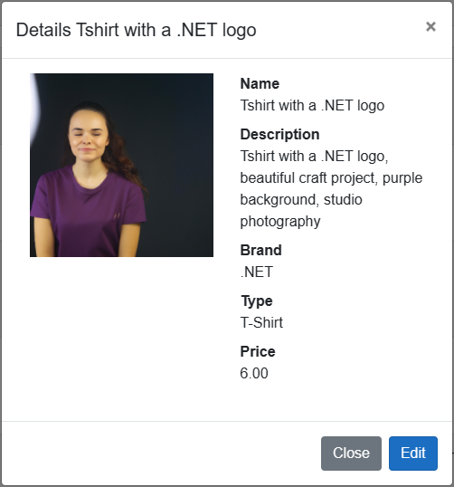

# AI-Powered eShopOnWeb E-commerce using Semantic Kernel
> This is the demo used during "Semantic Kernel: Empower your app with Azure OpenAI" talk at Azure Day Rome (23/06/2023).

🎯 The objective of this demo is to show how simple is to include AI capabilities in your apps with just a few lines of code.

This is an empowered version of the [eShopOnWeb](https://github.com/dotnet-architecture/eShopOnWeb) Ecommerce Sample app using [Microsoft Semantic Kernel](https://github.com/microsoft/semantic-kernel).

The new capabilities consist in:

1. Generate an enhanced prompt from the `Name` and `Description` fields of a new product using a Semantic Function.

2. Use that prompt to create an image of the product using DALL-E.

For convenience, the new features are located in  `src/ApplicationCore/Entities/Utility.cs`, you can check the code clicking [here](https://github.com/alexcalabrese/semantic-kernel-ecom/blob/dd3904e973977b415c0200d2e22674b979ac6447/src/ApplicationCore/Entities/Utility.cs#L8).

This is an example of a generated image using this demo:

<div align="center">
      
</div>

## Running the sample

> ⚠️ In order to use AI capabilites you have to add a `settings.json` file with your credentials in `src/ApplicationCore/config/`.

The store's home page should look like this:


Go to the PublicApi folder in a terminal window and run `dotnet run` from there. 

After that from the Web folder you should run `dotnet run --launch-profile Web`. 

Now you should be able to browse to `https://localhost:5001/`.

The admin part in Blazor is accessible to `https://localhost:5001/admin`

## Running the sample in the dev container

This project includes a `.devcontainer` folder with a [dev container configuration](https://containers.dev/), which lets you use a container as a full-featured dev environment.

You can use the dev container to build and run the app without needing to install any of its tools locally! You can work in GitHub Codespaces or the VS Code Dev Containers extension.

Learn more about using the dev container in its [readme](/.devcontainer/devcontainerreadme.md).

## Running the sample using Docker

You can run the Web sample by running these commands from the root folder (where the .sln file is located):

```
docker-compose build
docker-compose up
```

You should be able to make requests to localhost:5106 for the Web project, and localhost:5200 for the Public API project once these commands complete. If you have any problems, especially with login, try from a new guest or incognito browser instance.

You can also run the applications by using the instructions located in their `Dockerfile` file in the root of each project. Again, run these commands from the root of the solution (where the .sln file is located).
